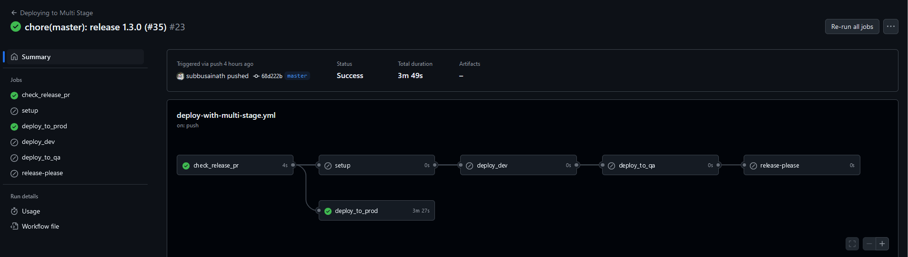

# ServerlessGuru-Code-Challenge
An Submission for a Code Challenge of Serverless Guru by Candidate Subbusainath Rengasamy

## Given Code Challenge

# AWS API Gateway CRUD REST API

## The Challenge

Build a Serverless Framework REST API with AWS API Gateway which supports CRUD functionality (Create, Read, Update, Delete) *don't use service proxy integration directly to DynamoDB from API Gateway

Please use GitHub Actions CI/CD pipeline, AWS CodePipeline, or Serverless Pro CI/CD to handle deployments.

You can take screenshots of the CI/CD setup and include them in the README.

The CI/CD should trigger a deployment based on a git push to the master branch which goes through and deploys the backend Serverless Framework REST API and any other resources e.g. DynamoDB Table(s).

### Requirements

0. All application code must be written using NodeJS, Typescript is acceptable as well

1. All AWS Infrastructure needs to be automated with IAC using [Serverless Framework](https://www.serverless.com)

2. The API Gateway REST API should store data in DynamoDB

3. There should be 4-5 lambdas that include the following CRUD functionality (Create, Read, Update, Delete) *don't use service proxy integration directly to DynamoDB from API Gateway

3. Build the CI/CD pipeline to support multi-stage deployments e.g. dev, prod

4. The template should be fully working and documented

4. A public GitHub repository must be shared with frequent commits

5. A video should be recorded (www.loom.com) of you talking over the application code, IAC, and any additional areas you want to highlight in your solution to demonstrate additional skills

Please spend only what you consider a reasonable amount of time for this.

## Optionally

Please feel free to include any of the following to show additional experience:

1. Make the project fit a specific business case e.g. Coffee Shop APIs vs Notes CRUD directly from AWS docs
2. AWS Lambda packaging
3. Organization of YAML files
4. Bash/other scripts to support deployment
5. Unit tests, integration tests, etc


# Solution

## CI/CD Pipelines

### Dev, QA and Release Please Deployment Flow


### Jest Test Flow During Pull request raise on the master branch


### Final Prod Deployment Flow


## Architecture Diagram of the Note Api CRUD


### Flow of the CI/CD Pipeline 
- Once you raise a Pull request to **master** branch **test.yml** will automatically runs the unit test for your files
- Once you merge that created Pull Request to **master** branch, the deployment workflow will start to setup your environment in the pipeline and start to deploy your resource into DEV, QA 
- And it will create a release please note for your service which you created here with another Pull request **master**. Why? because, you need to be the authorize one to merge the code to PRODUCTION environment.
- Once we merge that PR, action will trigger the deployment automatically for PRODUCTION
- In this Solution,we use Aws API Key as an authorizer.So, you need this API KEY to execute this Api Endpoints. For that, you need to run the following script in your terminal
```shell
npm run fetchApiKey -- YOUR_STAGE_NAME -- --profile YOUR_PROFILE_NAME/leave this as default
```
- based on your stage name you provide as well as the profile you provide. you can get the apikey to use.
- I have packaged the lambdas individually